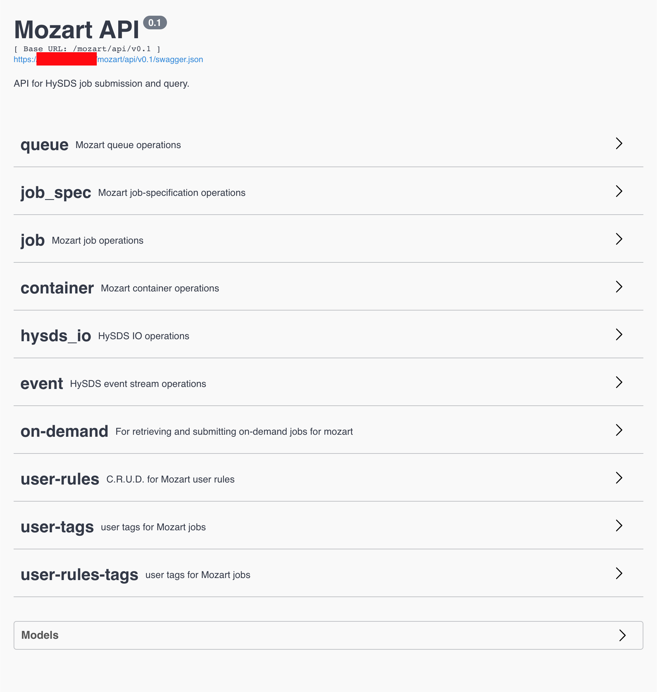

mozart
======

To install/develop
--------------------------
```bash
python setup.py develop|install
```

To run in development mode
--------------------------
```bash
python run.py
```

To run in production mode
--------------------------
```bash
gunicorn -w2 -b 0.0.0.0:8888 -k gevent --daemon -p mozart.pid mozart:app
```

Swagger UI
--------------------------
Simply go to:
* `https://<mozart host>/mozart/api/v0.1/` (api `v0.1`)
* `https://<mozart host>/mozart/api/v0.2/` (api `v0.2`)


